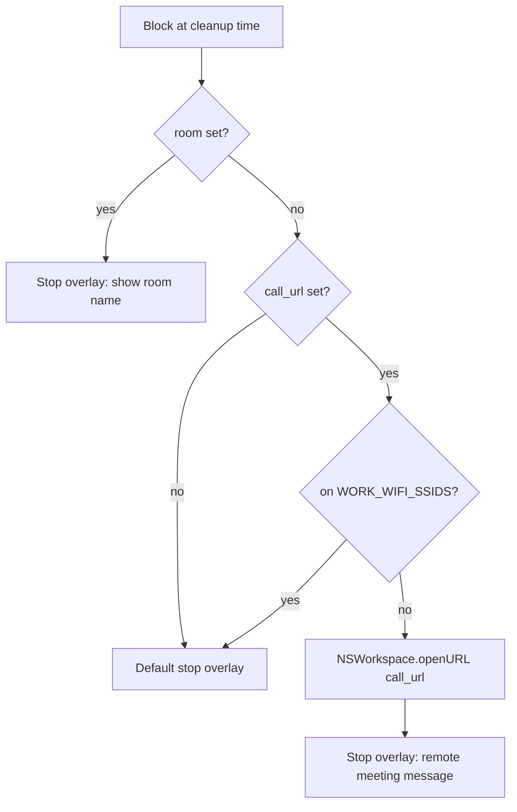

# Calendar calls, room overlay, and end-of-day hard stop

## Scope

Three session types, each with its own stroke color:

| Type | Color | Trigger |
|------|-------|---------|
| Manual (`./run 15`) | Blue (existing) | User input |
| Calendar | Green (existing `CALENDAR_STROKE_*`) | Nearest accepted event |
| Hard stop | New orange (`HARD_STOP_STROKE_*`) | `HARD_STOP_TIME` minus warning |

## 1. Config (`.env` + [`config.py`](tools/countdown/config.py))

New keys:

```
# Work WiFi — comma-separated SSIDs; when connected, skip auto-opening call links
WORK_WIFI_SSIDS=Office-Guest,CorpWiFi

# End-of-day hard stop (watch mode)
HARD_STOP_ENABLED=true
HARD_STOP_TIME=22:00          # local clock time
HARD_STOP_WARNING_MINS=30     # stroke starts this many minutes before HARD_STOP_TIME
HARD_STOP_STROKE_R=0.95
HARD_STOP_STROKE_G=0.55
HARD_STOP_STROKE_B=0.15
```

Add to `AppConfig`: `work_wifi_ssids`, `hard_stop_enabled`, `hard_stop_time` (parsed as `datetime.time`), `hard_stop_warning_mins`, `hard_stop_stroke_r/g/b`.

Reuse [`input_parse.parse_target_time`](tools/countdown/input_parse.py) logic or a small `_env_time("HARD_STOP_TIME", "22:00")` helper for clock parsing.

## 2. WiFi SSID detection (new [`wifi.py`](tools/countdown/wifi.py))

```python
def current_wifi_ssid() -> str | None:
    # networksetup -getairportnetwork en0  →  "Current Wi-Fi Network: SSID"
    # fallback: scan en1 if en0 not associated

def is_work_wifi(cfg: AppConfig) -> bool:
    ssid = current_wifi_ssid()
    return ssid is not None and ssid in cfg.work_wifi_ssids
```

No new PyObjC dependency — subprocess + `networksetup` is sufficient and matches existing AppleScript/subprocess style in [`countdown.py`](tools/countdown/countdown.py).

## 3. Richer calendar events ([`calendar_monitor.py`](tools/countdown/calendar_monitor.py))

Extend `CalendarEvent`:

```python
@dataclass(frozen=True)
class CalendarEvent:
    event_id: str
    title: str
    start: dt.datetime
    call_url: str | None = None   # zoom/meet/teams link
    room: str | None = None       # physical room name, if any
```

Parse from EventKit when building events:

- **Call URL**: `event.URL()` first; fallback regex on `location()` and `notes()` for `https://` meeting patterns (zoom.us, meet.google.com, teams.microsoft.com, etc.)
- **Room**: `location()` if non-empty and **not** URL-like (does not start with `http` and no meeting-host pattern). Treat as room name as-is (e.g. `"Room 4B"`, `"Building A — Conference"`).

Add helper `parse_event_fields(ek_event) -> tuple[str|None, str|None]` in this file.

## 4. Call link + room behavior at block time

Logic when [`CountdownApp._enter_stop_modal`](tools/countdown/countdown.py) fires for a **calendar** session:



- **Has room** → overlay headline/subline include room (e.g. `"Go to: Room 4B"`), do **not** open browser.
- **No room + call URL + not on work SSID** → open default browser via `NSWorkspace.sharedWorkspace().openURL_`, overlay says link opened.
- **On work SSID** → no auto-open even if call URL exists (assume in-office).

### Dynamic stop overlay

Refactor [`StopBlockView`](tools/countdown/countdown.py) — today lines are hardcoded in `drawRect_`:

```python
class StopBlockView:
    def initWithFrame_controller_lines_(self, frame, controller, lines):
        self._lines = lines  # list of (text, size, weight, alpha)
```

Add factory `_stop_modal_lines(app: CountdownApp) -> list` that returns:
- Default: existing three lines
- Calendar + room: `"It's time to go."` / `"Room: {room}"` / dismiss hint
- Calendar + remote: `"Remote meeting"` / `"Call link opened in browser"` / dismiss hint
- Hard stop: `"End of day."` / `"Hard stop — time to wrap up."` / dismiss hint

Pass lines when creating `StopBlockWindow` in `_enter_stop_modal`.

### CountdownApp metadata

Add fields alongside existing `is_calendar` / `event_start`:

```python
session_kind: str  # "manual" | "calendar" | "hard_stop"
event_title: str | None
call_url: str | None
room: str | None
```

`stroke_base` selection:

```python
if session_kind == "hard_stop": hard_stop_stroke_base(cfg)
elif session_kind == "calendar": calendar_stroke_base(cfg)
else: STROKE_BLUE
```

Propagate `call_url` / `room` / `event_title` through [`Watcher._start_from_nearest_event`](tools/countdown/countdown.py) and calendar retarget paths.

## 5. End-of-day hard stop (watch mode)

New helper in [`countdown.py`](tools/countdown/countdown.py) or small [`hard_stop.py`](tools/countdown/hard_stop.py):

```python
def hard_stop_target(cfg: AppConfig, now: dt.datetime | None = None) -> dt.datetime | None:
    """Return HARD_STOP_TIME today if now is within the warning window, else None."""
    # window: (hard_stop - WARNING_MINS, hard_stop]
    # if now past hard_stop today, return None (done for the day)
```

Watcher changes in [`Watcher.run`](tools/countdown/countdown.py):

- On startup and each poll, compute **candidates**:
  - Calendar: `calendar_block_target(event.start)` (existing)
  - Hard stop: `hard_stop_target(cfg)` when `HARD_STOP_ENABLED`
- Pick **nearest future** `block_at` among candidates
- Auto-start / retarget `CountdownApp` with matching `session_kind` and metadata

When hard stop is active, HUD label: `"12m 04s · hard stop 22:00"`.

Hard stop uses same block-on-end + shake pipeline; stroke counts down to `HARD_STOP_TIME` (zero = block), starting `HARD_STOP_WARNING_MINS` before.

**Priority**: nearest `target` wins (calendar cleanup at 21:53 beats hard stop at 22:00 if both in window). Retarget when a sooner candidate appears, same as calendar snap today.

## 6. Files to touch

| File | Changes |
|------|---------|
| [`config.py`](tools/countdown/config.py) | New env fields + time parser |
| [`wifi.py`](tools/countdown/wifi.py) | **New** — SSID read + work check |
| [`calendar_monitor.py`](tools/countdown/calendar_monitor.py) | `call_url`, `room` on events |
| [`countdown.py`](tools/countdown/countdown.py) | Session kinds, dynamic stop overlay, browser open, hard stop scheduling, Watcher candidate merge |
| [`.env`](tools/countdown/.env) | Document new keys with your SSIDs and `HARD_STOP_TIME` |

No plan file edits.

## 7. Test plan (manual, Mac)

1. Calendar event with Zoom URL in URL field, empty location, off work WiFi → at cleanup: browser opens, overlay mentions remote meeting.
2. Same event on work SSID (add current SSID to `WORK_WIFI_SSIDS`) → no browser open.
3. Calendar event with location `"Room 3A"` → overlay shows room, no browser.
4. `./run watch` at 21:35 with `HARD_STOP_TIME=22:00`, `HARD_STOP_WARNING_MINS=30` → orange stroke, block at 22:00.
5. Manual `./run 15` still blue; Finish + watch no-freeze behavior unchanged.
