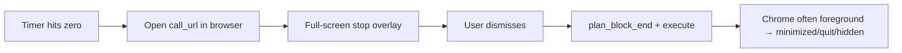

# Calendar calls without block-on-end for remote links

## Problem

The current plan ([`calendar_calls_hard_stop_f02c9444.plan.md`](.cursor/plans/calendar_calls_hard_stop_f02c9444.plan.md) §4) routes remote meetings through the same path as manual block-on-end:



With default `BLOCK_END_DEFAULT=minimize`, Chrome is very likely to be tidied after `NSWorkspace.openURL_` brings it to the front — exactly what you want to avoid.

## Decision

**When a calendar session will auto-open a remote call link, skip block-on-end entirely** — no `SessionState.BLOCKING`, no stop overlay, no `BlockEndExecutor` run. Log a one-line confirmation instead of overlay copy like “Call link opened in browser”.

| Calendar metadata | Work Wi‑Fi | At zero |
|-------------------|------------|---------|
| `room` set | any | Normal block-on-end if `BLOCK_ON_END` (overlay shows room; no browser) |
| `call_url`, no `room` | yes | Normal block-on-end if enabled; **no** browser open |
| `call_url`, no `room` | no | **Open URL + end session (DONE)** — never block/tidy |
| neither | any | Normal block-on-end if enabled |

Hard stop sessions are unchanged: they always use block-on-end when `BLOCK_ON_END` is on.

## Architecture (refactored codebase)

Implement against the **ports/adapters** tree, not the old monolithic `countdown.py` references in the original plan.

### 1. Domain predicate — [`session.py`](tools/countdown/countdown/domain/session.py)

Add optional metadata on `Session` (and `retarget()`):

- `call_url: str | None`
- `room: str | None`

Pure helper used by `_end()`:

```python
def skips_block_for_remote_call(self) -> bool:
    return (
        self.kind is SessionKind.CALENDAR
        and bool(self.call_url)
        and not self.room
    )
```

Update `_end()`:

```python
if self.config.block_on_end and not self.skips_block_for_remote_call():
    self.blocked = True
    self.state = SessionState.BLOCKING
else:
    self.state = SessionState.DONE
```

Add unit tests in [`test_session.py`](tools/countdown/tests/test_session.py): calendar + `call_url` + no `room` + `block_on_end=True` → `DONE` not `BLOCKING`; room present → still `BLOCKING`.

### 2. `UrlOpener` port — [`ports.py`](tools/countdown/countdown/ports.py) + macOS adapter

New port (stdlib + domain types only):

```python
class UrlOpener(Protocol):
    def open(self, url: str) -> bool: ...
```

Adapter: `adapters/macos/url_opener.py` using `NSWorkspace.sharedWorkspace().openURL_` (or `openURL:` via PyObjC). Fake in [`fakes.py`](tools/countdown/tests/fakes.py) records opened URLs.

**Work Wi‑Fi** stays in app layer: [`wifi.py`](tools/countdown/wifi.py) + `is_work_wifi(cfg)` — do not bake SSID into domain.

### 3. Open URL in [`session_runner.py`](tools/countdown/countdown/app/session_runner.py)

When the session leaves `RUNNING` at zero (or `finish()`), **before** overlay/cleanup logic:

```python
if (
    session.skips_block_for_remote_call()
    and session.call_url
    and not is_work_wifi(session.config)  # injected or passed Clock+wifi helper
):
    if url_opener.open(session.call_url):
        logger.info("Opened call link in browser.")
    else:
        logger.warn("Could not open call link.")
```

Wire `UrlOpener` through [`composition.py`](tools/countdown/countdown/composition.py) `_make_runner` and watch `SessionFactory`.

Remove from the plan: remote stop-overlay lines (`"Remote meeting"` / `"Call link opened in browser"`). Keep dynamic stop lines **only** for room + hard stop (via existing [`StopOverlay.show(lines)`](tools/countdown/countdown/app/session_runner.py) — today hardcoded `_STOP_LINES`; refactor to `_stop_lines(session)` as planned, minus remote branch).

### 4. Calendar fields — unchanged from original plan

[`calendar.py`](tools/countdown/countdown/domain/calendar.py) / [`adapters/macos/calendar.py`](tools/countdown/countdown/adapters/macos/calendar.py): `call_url`, `room` on `CalendarEvent`; propagate through [`watch_runner.py`](tools/countdown/countdown/app/watch_runner.py) `_start_session` / `retarget`.

### 5. Docs + acceptance

Update [`features.md`](tools/countdown/docs/features.md) §“Future session kinds”:

- Remote call: opens browser at zero when off work Wi‑Fi; **does not** run block-on-end even if `BLOCK_ON_END=true` (so the meeting tab is not closed by tidy).
- Room: stop overlay shows room when block-on-end is on.

Update manual test in plan §7:

1. Off work Wi‑Fi, Zoom URL, `BLOCK_ON_END=true` → browser opens, **no** full-screen overlay, Chrome stays open/foreground.
2. Same with `BLOCK_ON_END=false` → same (no overlay either way).
3. Room-only event + `BLOCK_ON_END=true` → overlay with room, tidy on dismiss as today.

### 6. Still in scope from original plan (unchanged)

- Config: `WORK_WIFI_SSIDS`, `HARD_STOP_*`
- [`wifi.py`](tools/countdown/wifi.py)
- Hard stop scheduling + orange stroke (`SessionKind.HARD_STOP`)
- Room-specific stop overlay copy

## Files to touch (delta from original plan)

| File | Change |
|------|--------|
| [`session.py`](tools/countdown/countdown/domain/session.py) | `call_url`, `room`, `skips_block_for_remote_call`, `_end()` guard |
| [`session_runner.py`](tools/countdown/countdown/app/session_runner.py) | `UrlOpener`, open-at-zero, dynamic `_stop_lines` (room/hard_stop only) |
| [`ports.py`](tools/countdown/countdown/ports.py) | `UrlOpener` protocol |
| `adapters/macos/url_opener.py` | **New** |
| [`composition.py`](tools/countdown/countdown/composition.py) | Wire opener + session metadata |
| [`watch_runner.py`](tools/countdown/countdown/app/watch_runner.py) | Pass `call_url` / `room` |
| [`calendar.py`](tools/countdown/countdown/domain/calendar.py) + macOS calendar adapter | Parse fields |
| [`features.md`](tools/countdown/docs/features.md) | Acceptance for no-block remote calls |
| [`test_session.py`](tools/countdown/tests/test_session.py) | Predicate tests |
| [`test_session_runner.py`](tools/countdown/tests/test_session_runner.py) | Fake opener: open called, stop overlay not shown |

**Drop** from original plan: remote-meeting stop-overlay branch and mermaid edge `openBrowser --> remoteModal`.
