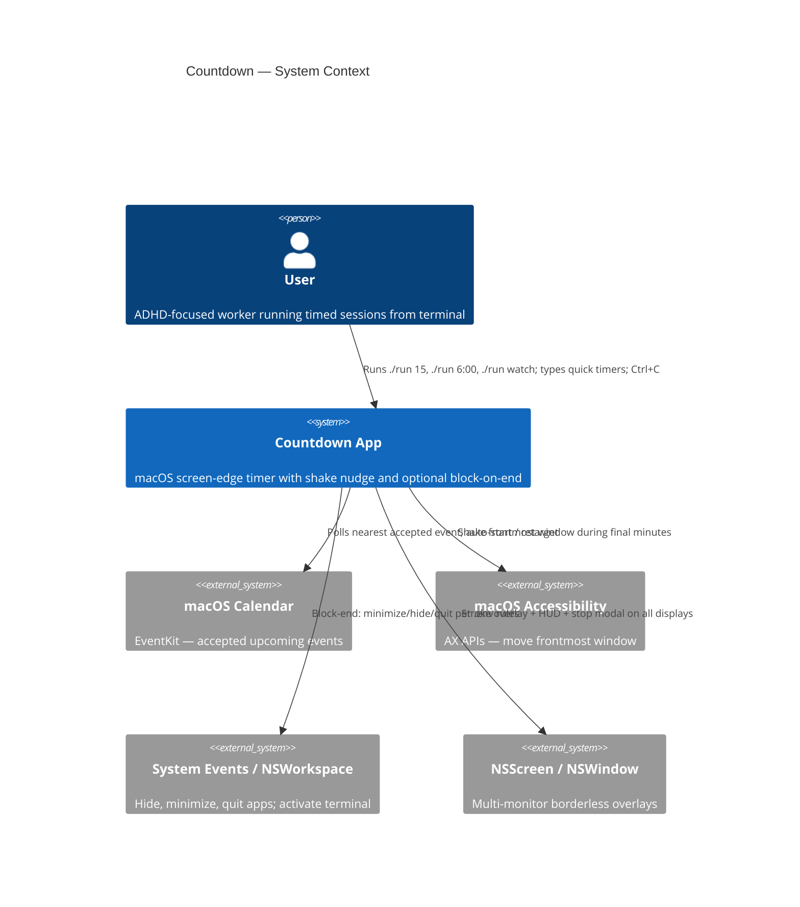
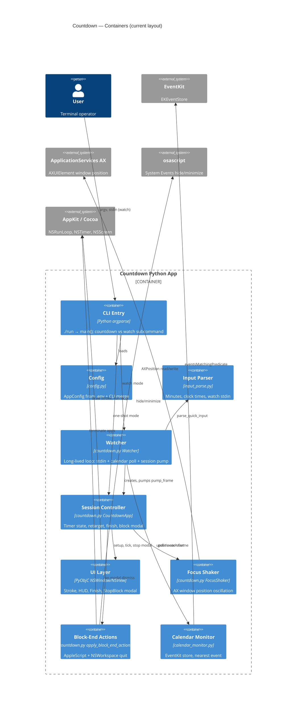
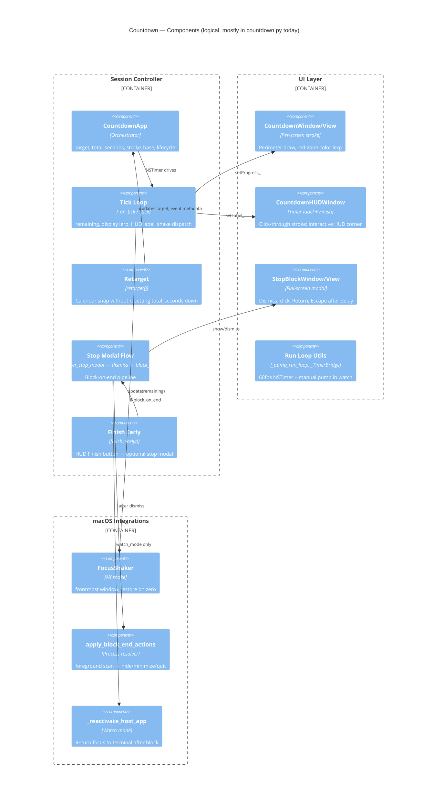
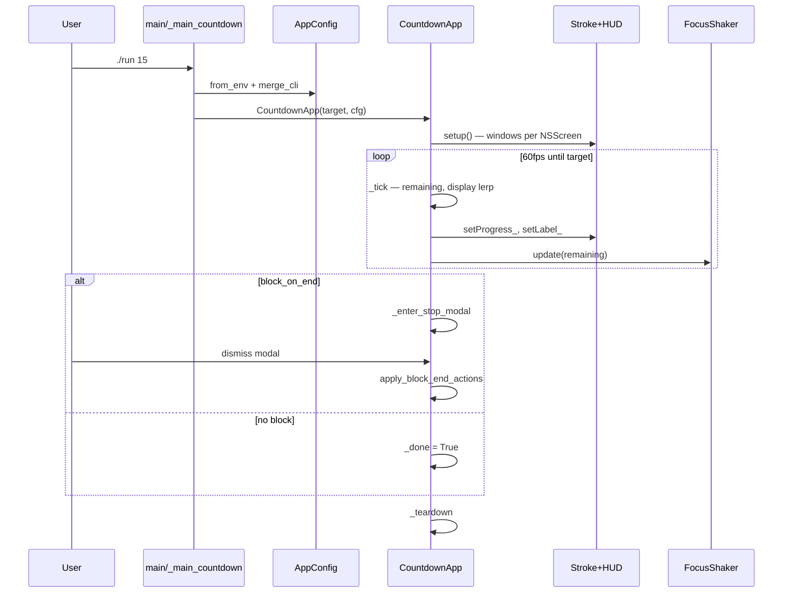
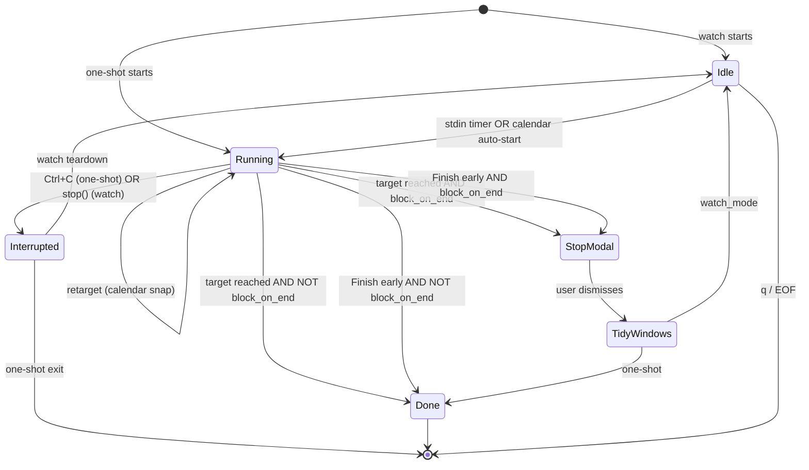

# Countdown app: C4 architecture + SOLID rebuild documentation plan

## What exists today

A macOS-only **screen-edge countdown timer** in [`tools/countdown/`](tools/countdown/). Invoked via [`tools/countdown/run`](tools/countdown/run) (venv bootstrap + `countdown.py`).

| File | Lines | Role |
|------|-------|------|
| [`countdown.py`](tools/countdown/countdown.py) | ~1621 | **Monolith**: CLI, UI (PyObjC), session loop, shake, block-end, watcher |
| [`config.py`](tools/countdown/config.py) | ~172 | `.env` loader + `AppConfig` + `shake_intensity()` |
| [`calendar_monitor.py`](tools/countdown/calendar_monitor.py) | ~181 | EventKit polling → `CalendarEvent` |
| [`input_parse.py`](tools/countdown/input_parse.py) | ~70 | Time/minute parsing for CLI + watch stdin |
| [`shake_test.py`](tools/countdown/shake_test.py) | ~267 | Standalone shake tuning harness (duplicates AX logic) |

**SOLID/DRY violations to document (not fix yet):**
- `_smoothstep` duplicated in `countdown.py` and `config.py`; `_lerp` duplicated in `countdown.py` and `shake_test.py`
- `FocusShaker` AX window-move logic duplicated in `shake_test.py`
- PyObjC view classes, AppleScript subprocesses, and session state machine all live in one file
- No protocols/interfaces — concrete macOS bindings are hard-wired
- `CountdownApp` owns UI creation, tick loop, stop modal, and block-end side effects
- Debug agent-logging hardcoded to a repo path inside production code

**Planned but not yet implemented** (from [`.cursor/plans/calendar_calls_hard_stop_f02c9444.plan.md`](.cursor/plans/calendar_calls_hard_stop_f02c9444.plan.md)): hard-stop sessions, WiFi SSID gating, calendar call URLs/rooms, dynamic stop-overlay copy. Documentation should include these as **future session kinds** so the target architecture accommodates them.

---

## Deliverable 1: `tools/countdown/architecture.md`

Single markdown file with the sections below. All diagrams use Mermaid (C4 + sequence + state).

### Level 1 — System Context



### Level 2 — Container Diagram



### Level 3 — Component Diagram (inside Session + UI)



### Workflow — One-shot manual countdown



### Workflow — Watch mode (calendar + stdin)

```mermaid
sequenceDiagram
  participant User
  participant Watcher
  participant Cal as CalendarMonitor
  participant App as CountdownApp
  participant Input as parse_quick_input

  User->>Watcher: ./run watch
  Watcher->>Cal: ensure_access
  Watcher->>Cal: nearest_event_within
  alt event in window
    Watcher->>App: start at calendar_block_target
  end
  loop until quit
    Watcher->>Watcher: _poll_stdin
    opt user types "20"
      Watcher->>Input: parse_quick_input
      Watcher->>App: _start_countdown_at (replaces running)
    end
    Watcher->>Watcher: _poll_calendar every N sec
    opt sooner calendar event
      Watcher->>App: retarget(block_at, calendar metadata)
    end
    Watcher->>App: pump_frame()
    opt session ended + block dismissed
      Watcher->>Watcher: _reactivate_host_app; countdown = None
    end
  end
```

### State machine — Session lifecycle



---

## Deliverable 2: Documentation set for SOLID/DRY rebuild

An agent rebuilding this app needs **spec + architecture + contracts + behavior tables**, not just diagrams. Create these files under `tools/countdown/docs/` (or flat in `tools/countdown/` — prefer `docs/` to keep root clean):

### Required documents

| Doc | Purpose | Key contents |
|-----|---------|--------------|
| **`architecture.md`** | C4 + state + container map | Diagrams above; link to all other docs |
| **`features.md`** | Feature inventory | Manual timer, watch mode, calendar auto-start/retarget, multi-monitor stroke, red-zone color, shake curve, block-on-end, finish early, per-app block rules; **future**: hard stop, call URL, room overlay, WiFi gate |
| **`workflows.md`** | Step-by-step behavior | Sequence diagrams for each mode; edge cases (retarget doesn't shrink `total_seconds`, finished calendar event dedup, SIGINT during stop modal, watch vs one-shot block-end skip lists) |
| **`config-reference.md`** | Every env var + CLI flag | Map each `AppConfig` field → env key → default → behavior impact; include `BLOCK_END_*` alias table (`chrome` → `Google Chrome`) |
| **`domain-model.md`** | Entities and invariants | `SessionKind` (manual \| calendar \| hard_stop), `CalendarEvent`, `AppConfig`, `BlockAction` enum; invariants: stroke fraction 0–1, shake uses `shake_intensity(remaining, total, cfg)`, calendar block_at = event_start − `CALENDAR_BLOCK_BEFORE_MINS` |
| **`interfaces.md`** | Target protocols (for rebuild) | Define abstract boundaries an agent should implement: `TimerInputParser`, `CalendarSource`, `WindowShaker`, `BlockEndExecutor`, `OverlayRenderer`, `SessionClock`, `ConfigProvider` — with method signatures and which macOS API sits behind each |
| **`module-map.md`** | Target package layout | Proposed tree (see below); maps **current symbol → target module** for every public function/class |
| **`macos-permissions.md`** | Platform prerequisites | Calendar Full Access, Accessibility for terminal, optional EventKit/ApplicationServices install; doctor-style checklist |
| **`testing-strategy.md`** | How to verify without manual Mac every time | Pure-Python unit tests: `input_parse`, `shake_intensity`, `calendar_block_target`, block-end name resolution; fakes for protocols; manual Mac checklist for PyObjC UI; keep `shake_test.py` as integration harness |
| **`migration-checklist.md`** | Ordered refactor steps | Extract shared math → extract mac/applescript → extract UI → introduce protocols → split CountdownApp orchestration from views → Watcher as thin coordinator; **no behavior change** gates between steps |

### Proposed target package layout (document only — do not implement)

```
tools/countdown/
  pyproject.toml              # package metadata, entry point countdown = countdown.main:main
  countdown/
    main.py                   # argparse only; dispatches watch | countdown
    config/
      env.py                  # load_dotenv, parsers
      settings.py             # AppConfig, merge_cli
    domain/
      session.py              # SessionKind, session metadata dataclass
      timer_math.py           # calendar_block_target, format_duration, stroke color helpers
      shake_curve.py          # shake_intensity + single _smoothstep
      lerp.py                 # shared _lerp
    input/
      parse.py                # parse_target_time, parse_quick_input
    calendar/
      models.py               # CalendarEvent
      monitor.py              # CalendarMonitor (implements CalendarSource)
    mac/
      run_loop.py             # pump, timer bridge
      accessibility.py        # FocusShaker backend
      applescript.py          # hide/minimize/foreground list
      workspace.py            # quit app, open URL (future)
      wifi.py                 # future: SSID detection
    block_end/
      resolver.py             # action_for_process, expand aliases
      executor.py             # apply_block_end_actions
    ui/
      stroke.py               # CountdownWindow/View
      hud.py                  # HUD + FinishControl
      stop_modal.py           # StopBlock*, dynamic lines factory (future)
      colors.py               # STROKE_BLUE, red-zone lerp
    session/
      controller.py           # CountdownApp — orchestrates, no drawRect_
    watcher/
      watcher.py              # Watcher + stdin poll
  docs/                       # all markdown above
  architecture.md             # or symlink → docs/architecture.md
  shake_test.py               # stays as dev harness; imports from countdown.mac.accessibility
  run                         # unchanged UX
```

### Symbol migration table (excerpt for `module-map.md`)

| Current location | Symbol | Target module |
|------------------|--------|---------------|
| `countdown.py` | `CountdownApp` | `session/controller.py` |
| `countdown.py` | `Watcher` | `watcher/watcher.py` |
| `countdown.py` | `FocusShaker` | `mac/accessibility.py` |
| `countdown.py` | `apply_block_end_actions` | `block_end/executor.py` |
| `countdown.py` | `StopBlockView/Window` | `ui/stop_modal.py` |
| `countdown.py` | `CountdownView/Window` | `ui/stroke.py` |
| `config.py` | `shake_intensity` | `domain/shake_curve.py` |
| `config.py` | `_smoothstep` | `domain/shake_curve.py` (delete duplicate) |
| `input_parse.py` | all | `input/parse.py` |
| `calendar_monitor.py` | all | `calendar/*` |

### Behavior tables agents must not get wrong

Document explicitly in `workflows.md` / `domain-model.md`:

1. **Shake window**: starts at `SHAKE_BEFORE_MINS` before end (or `SHAKE_START_FRACTION` of total if shorter); nudge ramp in first `SHAKE_NUDGE_SECONDS`; stops at `SHAKE_STOP_BEFORE_MINS` before zero.
2. **Calendar block target**: `event_start - CALENDAR_BLOCK_BEFORE_MINS`; skip if block_at ≤ now.
3. **Retarget**: only extends `total_seconds`, never shrinks — affects shake curve baseline.
4. **Block-on-end**: stop modal **above** screen saver level; 0.6s dismiss delay; stroke/HUD hidden during modal; actions run **after** dismiss on next pump tick.
5. **Watch block-end**: extra skip = terminal host apps; reactivate terminal after tidy.
6. **Calendar dedup**: `_finished_calendar_events` prevents re-trigger until event start passes.
7. **Skip shake apps**: terminal, Cursor, Python, system UI — never shaken.

### SOLID mapping (for `interfaces.md` intro)

| Principle | Current pain | Target fix |
|-----------|--------------|------------|
| **S** | `countdown.py` does CLI + UI + AX + AppleScript | One module per concern in package tree |
| **O** | New session kind requires editing CountdownApp stroke logic | `SessionKind` + stroke strategy registry |
| **L** | N/A (no inheritance) | Fakes implement same protocols as mac adapters |
| **I** | CountdownApp touches everything | Narrow protocols: shaker, block executor, overlay factory |
| **D** | Direct PyObjC/AppKit imports in session loop | Controller depends on protocols; mac/ holds implementations |

---

## What we are NOT doing in this task

- No code split, no new packages, no refactors
- No implementing calendar-calls / hard-stop features (only document as future session kinds)
- No commit unless you ask

---

## Suggested file creation order

1. `tools/countdown/architecture.md` — C4 + sequences + state (this plan's diagrams, polished)
2. `tools/countdown/docs/features.md` — feature list with acceptance criteria
3. `tools/countdown/docs/domain-model.md` + `config-reference.md`
4. `tools/countdown/docs/workflows.md` — edge cases from code review of [`CountdownApp`](tools/countdown/countdown.py) and [`Watcher`](tools/countdown/countdown.py)
5. `tools/countdown/docs/interfaces.md` + `module-map.md`
6. `tools/countdown/docs/macos-permissions.md` + `testing-strategy.md` + `migration-checklist.md`

After docs land, a separate task can execute `migration-checklist.md` step-by-step with tests after each extraction.
