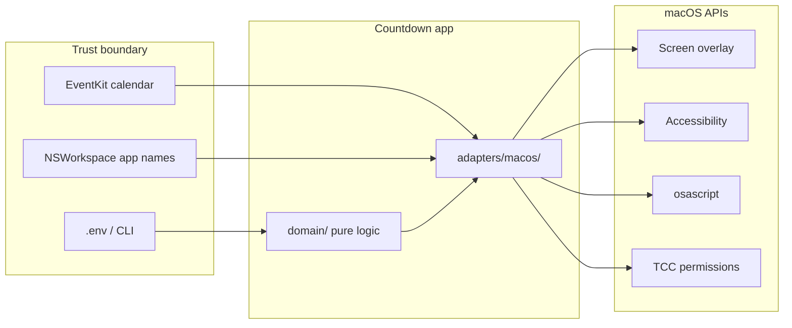
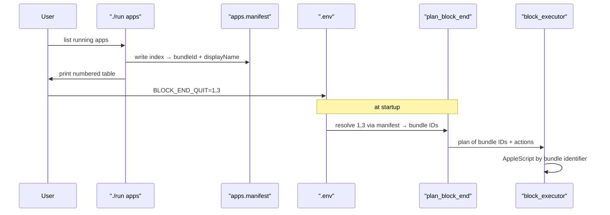
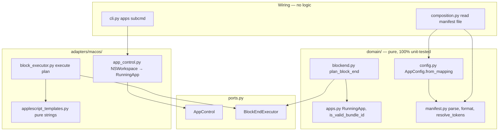

# Security Review — Countdown Timer

## Scope and sensitivity

**Project:** [tools/countdown/](tools/countdown/) — local macOS screen-edge countdown timer (Ports & Adapters, no server/network).

**Sensitivity level: LOW**

- Runs entirely as the logged-in user; no multi-tenant or remote attack surface
- No API keys, tokens, or credentials in config ([`.env.example`](tools/countdown/.env.example) is visual tuning only)
- No HTTP, sockets, or data exfiltration paths
- Threat model: a malicious app already installed on the machine, or a user misconfiguring their own `.env`



---

## Findings (ranked by severity)

### Medium — AppleScript injection via unsanitized app names

**Location:** [`countdown/adapters/macos/block_executor.py`](tools/countdown/countdown/adapters/macos/block_executor.py) — `_name_list()` (lines 124–128), used by `_hide_processes()` and `_minimize_processes()`

**Issue:** Process names are interpolated into AppleScript double-quoted string literals without escaping:

```124:128:tools/countdown/countdown/adapters/macos/block_executor.py
def _name_list(names: list[str]) -> str:
    """Render an AppleScript list literal of process names."""
    if not names:
        return "{}"
    return "{" + ", ".join(f'"{name}"' for name in sorted(set(names))) + "}"
```

A process whose `CFBundleDisplayName` / `localizedName()` contains `"` and AppleScript operators (e.g. `foo" & do shell script "rm -rf ~" & "x`) could break out of the string and execute arbitrary AppleScript — including `do shell script`.

**Name sources (verified):**
- `NSWorkspace.runningApplications().localizedName()` — controlled by installed apps
- `foreground_app_names()` in [`app_control.py`](tools/countdown/countdown/adapters/macos/app_control.py) — parsed from `osascript` stdout via `raw.split(", ")` (comma-containing names split incorrectly)

**Not in scope:** Calendar event titles flow to logging only ([`watch_runner.py:233`](tools/countdown/countdown/app/watch_runner.py)); they never reach `_name_list`. `.env` block-end lists are used for *matching* only — plan entries always use live app names from [`blockend.py`](tools/countdown/countdown/domain/blockend.py), not raw `.env` strings.

**Impact:** Local-only; requires a malicious or specially crafted app to be running at block-end. Real-world likelihood is low for a personal ADHD timer, but the code path is genuine.

**If fixed later:** Escape `"` as `\"` in `_name_list`, or avoid string interpolation entirely (e.g. pass names via stdin/JSON to a small AppleScript handler). Add a unit test for names containing `"`, `\`, and `&`.

---

### Low — Unhandled `ValueError` on malformed `.env` floats

**Location:** [`countdown/domain/config.py`](tools/countdown/countdown/domain/config.py) — `_as_float()` (lines 112–114)

**Issue:** `float(raw)` raises on non-numeric values (e.g. `STROKE_WIDTH=abc`), crashing at startup with a traceback instead of a clear config error.

**Impact:** User error / fragile config surface, not a security vulnerability. No privilege escalation.

---

### Low — No dependency pinning

**Location:** [`requirements.txt`](tools/countdown/requirements.txt) — floor-only bounds (`>=10.0`) on three PyObjC packages

**Impact:** Supply-chain drift on `pip install`; minimal for a personal local tool. Worth pinning before distributing to others or running in CI.

---

### Info — Calendar titles logged to stdout

**Location:** [`watch_runner.py:233`](tools/countdown/countdown/app/watch_runner.py) — `logger.info(f"Calendar → … ({event.title})")`

Expected for a personal tool. Only relevant if logs are ever forwarded to a remote sink.

---

### Info — `forceTerminate()` can cause data loss

**Location:** [`block_executor.py`](tools/countdown/countdown/adapters/macos/block_executor.py) — `_quit_application()` (lines 68–69)

Intentional “time’s up” behavior. Already implied by [`docs/features.md`](tools/countdown/docs/features.md); could be called out more explicitly under `BLOCK_END_QUIT` in user-facing docs.

---

## What is done well

| Area | Detail |
|------|--------|
| **No shell injection** | All three `subprocess.run` calls use list args — no `shell=True`. [`app_control.py`](tools/countdown/countdown/adapters/macos/app_control.py), [`block_executor.py`](tools/countdown/countdown/adapters/macos/block_executor.py) |
| **Secrets hygiene** | `.env` has no secrets; [`.gitignore`](.gitignore) excludes `.env` recursively |
| **Env isolation** | [`DotEnvSource`](tools/countdown/countdown/adapters/system/dotenv.py) returns a mapping; never mutates `os.environ` (edge-case #5) |
| **Input validation** | `_as_action` allowlist; `AppConfig.merge()` rejects unknown CLI keys; `SYSTEM_SKIP` hardcodes protected processes |
| **Architecture boundary** | `domain/` and `app/` never import platform SDKs — grep gate enforced per [`development.md`](tools/countdown/docs/development.md) |
| **Permissions** | Calendar and Accessibility adapters check TCC status and degrade gracefully |
| **Signal safety** | SIGINT handler only sets a latch flag (edge-case #20) |
| **No network** | Zero HTTP/socket/DNS usage |

---

## Risk summary

| Severity | Count | Action |
|----------|-------|--------|
| Critical / High | 0 | — |
| Medium | 1 | AppleScript escaping in `_name_list` (awareness only for now) |
| Low | 2 | `.env` float validation; dependency pinning |
| Info | 2 | Logging; force-quit UX |

**Verdict:** Safe to use as a personal local tool. The Medium finding is the only item worth tracking if you ever distribute the app or run untrusted third-party software alongside it.

---

## Proposed remediation: numbered app list (user iteration)

**User goal:** Stop typing app names in `.env`. Instead, run a command that prints a numbered list of running apps; reference apps by index in `BLOCK_END_*` keys.

**Chosen model:** Running snapshot — regenerate the list when the app set changes.

### Important caveat: numbers alone don't fix the Medium finding

The AppleScript injection vector is **live display names at block-end time**, not strings the user types in `.env`. Today `.env` names are only used for *matching*; the plan always carries the runtime `localizedName()` ([`blockend.py`](tools/countdown/countdown/domain/blockend.py) lines 84–93).

So `BLOCK_END_QUIT=1,3` without deeper changes still ends up calling `_name_list(["Google Chrome", …])` with whatever display name NSWorkspace returns — including a malicious one.

**To get both UX and security**, the snapshot must capture **bundle identifiers** (stable, restricted charset — no `"` or AppleScript operators), and the executor must target by bundle ID instead of display name:

```applescript
tell application "System Events"
    tell (first process whose bundle identifier is "com.google.Chrome")
        set visible to false
    end tell
end tell
```

### Recommended design



**1. New command: `./run apps`** (macOS only, in [`cli.py`](tools/countdown/countdown/cli.py))

Print a table and write a sidecar manifest next to `.env`:

```
$ ./run apps
 1  Google Chrome       com.google.Chrome
 2  Cursor              com.todesktop.213803m5...
 3  Slack               com.tinyspeck.slackmacgap

Copy into .env:  BLOCK_END_QUIT=1,3
Manifest written: tools/countdown/apps.manifest
```

**2. Manifest file:** [`tools/countdown/apps.manifest`](tools/countdown/apps.manifest) (gitignored)

```
# generated by ./run apps — re-run when your running apps change
1=com.google.Chrome
2=com.todesktop.213803m5fafj212j0w1p2j7q8
3=com.tinyspeck.slackmacgap
```

Display names live only in the printed table (human-readable), not in config or AppleScript.

**3. `.env` syntax:** indices in `BLOCK_END_*` CSV fields

```
BLOCK_END_QUIT=1,3
BLOCK_END_SKIP=2
```

Resolution is **pure domain logic** (not in `composition.py` — see SOLID section below). Non-numeric tokens keep working as today's alias-aware display names (backward compatible).

**4. Domain changes:** new modules + refactored `plan_block_end` — details in Architecture section.

**5. Adapter changes:** narrow port updates + extracted AppleScript templates — details in Architecture section.

**6. Regeneration workflow (running snapshot)**

User re-runs `./run apps` whenever they install/remove apps or change which indices they want. If manifest is stale (index missing), startup warns: `BLOCK_END_QUIT index 5 not in apps.manifest — run ./run apps`.

### Tradeoffs vs typing names

| | Typed names (today) | Numbered snapshot |
|--|---|---|
| Typo risk | High (`Google Chorme`) | Low |
| Stability across reboots | Names stable; aliases help | Indices shift if app set changes — must re-run `./run apps` |
| Security | Display names in AppleScript | Bundle IDs in AppleScript — injection-safe |
| Discoverability | User must know app names | `./run apps` shows what's running now |
| New apps | Just add name to `.env` | Re-run `./run apps`, update indices |

**Out of scope:** indexing *installed* apps not currently running (user chose running snapshot only).

### Revised Medium-finding remediation

Preferred fix order if this ships:
1. Bundle-ID-based executor (closes injection)
2. `./run apps` + manifest + index resolution (closes UX)
3. Keep display-name aliases as legacy fallback for users who already have name-based `.env`

---

## Architecture — SOLID and DRY

Follow [`development.md`](tools/countdown/docs/development.md) §5–7. **No business logic in `composition.py` or `cli.py`** — they wire only.

### Layer map



### SOLID per module

| Principle | Rule for this feature |
|-----------|----------------------|
| **S — Single Responsibility** | `manifest.py` = file format only. `apps.py` = app identity types + bundle-ID validation. `applescript_templates.py` = script strings only. `block_executor.py` = subprocess + NSRunningApplication only. |
| **O — Open/Closed** | Add `AppSelector` frozen union (`ByBundleId` / `ByDisplayName`) in `domain/apps.py`. Config normalizes env tokens → selectors once. `plan_block_end` matches via one `app_matches_selector(app, selector)` function — new selector kinds add a branch there, not scattered `if`s in `session_runner`. |
| **L — Liskov** | `FakeAppControl` and `FakeBlockExecutor` updated to honour the new port signatures (same return types, same empty-list degradation). |
| **I — Interface Segregation** | Extend `AppControl` with `running_apps() -> list[RunningApp]` and `foreground_apps() -> list[RunningApp]`. **Remove** `running_app_names()` / `foreground_app_names()` in the same PR (no parallel dead API). `BlockEndExecutor.execute(plan: list[tuple[str, BlockAction]])` — the `str` becomes **bundle ID** (document in `ports.md`). |
| **D — Dependency Inversion** | `session_runner` calls `plan_block_end(running_apps, foreground_apps, cfg)` using port return types. Manifest **file read** stays in `composition.py`; manifest **parse/resolve** stays in `domain/manifest.py`. Mac adapter never imports `manifest.py` for config — only `./run apps` uses both. |

### DRY rules

- **One alias table** — keep `_PROCESS_ALIASES` in [`blockend.py`](tools/countdown/countdown/domain/blockend.py); do not duplicate in manifest or config.
- **One bundle-ID validator** — `is_valid_bundle_id()` in `domain/apps.py`; called by manifest resolver, AppleScript template builder, and `./run apps` snapshot writer.
- **One manifest format** — `parse_manifest(text)` and `format_manifest(index_to_bundle_id)` in `domain/manifest.py`; `./run apps` and `composition.py` both use these (no second parser).
- **One sort order** — `sort_apps_for_manifest(apps: list[RunningApp])` in `domain/apps.py` (e.g. by display name, case-insensitive); Mac adapter and table printer both use it.
- **One AppleScript pattern** — `hide_script(bundle_ids)` and `minimize_script(bundle_ids)` in [`adapters/macos/applescript_templates.py`](tools/countdown/countdown/adapters/macos/applescript_templates.py) with a shared inner loop helper; delete `_name_list()`.
- **No copy-pasted block-end list resolution** — single `resolve_block_end_csv(raw_csv, manifest) -> frozenset[AppSelector]` used for all four `BLOCK_END_*` keys in `AppConfig.from_mapping`.

### Domain types (new)

```python
# domain/apps.py
@dataclass(frozen=True)
class RunningApp:
    bundle_id: str | None   # None for odd processes without a bundle
    display_name: str
    is_foreground: bool     # only set when queried via foreground_apps()

@dataclass(frozen=True)
class AppSelector:
    kind: Literal["bundle_id", "display_name"]
    value: str
```

`plan_block_end` signature becomes:

```python
def plan_block_end(
    running_apps: Iterable[RunningApp],
    foreground_apps: Iterable[RunningApp],
    cfg: AppConfig,
    extra_skip: Iterable[AppSelector] = (),
) -> list[tuple[str, BlockAction]]:  # str = bundle_id
```

Apps without a `bundle_id` are matchable only via legacy display-name selectors; they never appear in the executed plan as a display name (skip or log once).

### Config load flow

1. `composition.py` reads `apps.manifest` if present (else empty dict).
2. `AppConfig.from_mapping(env, manifest=index_map)` calls `resolve_block_end_csv` per key.
3. Unresolved indices collected → passed to logger as warnings at startup (composition logs via injected `Logger`, not `print`).

### Files to create / change

| File | Responsibility |
|------|----------------|
| `domain/apps.py` | **New** — `RunningApp`, `AppSelector`, `is_valid_bundle_id`, `sort_apps_for_manifest`, `app_matches_selector` |
| `domain/manifest.py` | **New** — `parse_manifest`, `format_manifest`, `resolve_block_end_csv` |
| `domain/blockend.py` | Plan by bundle ID; legacy display-name selectors via `app_matches_selector` |
| `domain/config.py` | `block_end_*` become `frozenset[AppSelector]`; `from_mapping(..., manifest=)` |
| `ports.py` | `AppControl` running/foreground → `list[RunningApp]`; document bundle-ID plans |
| `adapters/macos/applescript_templates.py` | **New** — pure script builders, zero PyObjC imports |
| `adapters/macos/app_control.py` | Return `RunningApp`; drop comma-split `osascript` name list (use `bundleIdentifier` + AX foreground bit) |
| `adapters/macos/block_executor.py` | Quit/hide/minimize by bundle ID; delegate scripts to templates module |
| `cli.py` | `apps` subcommand — thin: query adapter, print table, write manifest via `format_manifest` |
| `composition.py` | Read manifest path; pass to `from_mapping`; warn on unresolved indices |
| `tests/fakes.py` | `FakeAppControl` / `FakeBlockExecutor` honour new contracts |
| [`docs/manual-testing.md`](tools/countdown/docs/manual-testing.md) | **New §11** — numbered app manifest + bundle-ID block-end manual paths (see below) |
| [`docs/development.md`](tools/countdown/docs/development.md) | Tier 3 bullet list → one-line cross-ref to `manual-testing.md` §11 (no duplicate checklist) |
| docs + `.gitignore` | `configuration.md`, `domain.md`, `ports.md`, `.env.example`; gitignore `apps.manifest` |

---

## Tests

Follow the three-tier strategy in [`development.md`](tools/countdown/docs/development.md) §2. **Target: 100% branch coverage of new domain modules.**

### Tier 1 — Domain (new + updated, runs on Linux)

#### `tests/test_apps.py` (new)

| Test | Asserts |
|------|---------|
| `is_valid_bundle_id` parametrize | `"com.google.Chrome"` ✓; `""`, `"foo bar"`, `'com.evil" & do shell'`, `"a&b"`, `"a;rm"` ✗ |
| `sort_apps_for_manifest` | Stable case-insensitive display-name order; ties broken deterministically |
| `app_matches_selector` by bundle | Selector `bundle_id` matches `RunningApp.bundle_id` |
| `app_matches_selector` by display | Legacy alias `chrome` matches `RunningApp(display_name="Google Chrome", ...)` |
| `app_matches_selector` None bundle | Display-name selector still matches; bundle-only plan excludes app |

#### `tests/test_manifest.py` (new)

| Test | Asserts |
|------|---------|
| `parse_manifest` happy path | `1=com.foo\n2=com.bar` → `{1: "com.foo", 2: "com.bar"}` |
| `parse_manifest` ignores comments/blanks | `# comment`, empty lines skipped |
| `parse_manifest` rejects invalid bundle ID lines | Line skipped or parse error per chosen contract (pick one, test it) |
| `parse_manifest` duplicate index | Document behaviour (last wins) and test |
| `format_manifest` round-trip | `parse(format(m)) == m` for valid maps |
| `resolve_block_end_csv` numeric | `"1,3"` + manifest → two `ByBundleId` selectors |
| `resolve_block_end_csv` mixed | `"1,chrome"` → one bundle + one display selector |
| `resolve_block_end_csv` stale index | `"99"` → omitted from set; returned in `unresolved: list[str]` for logging |
| `resolve_block_end_csv` empty / whitespace | `""` → empty frozenset |

#### `tests/test_blockend.py` (extend)

| Test | Asserts |
|------|---------|
| Migrate existing 10 tests | Use `RunningApp` + bundle IDs where applicable; behaviour unchanged |
| `test_plan_precedence_quit_by_bundle_id` | Explicit bundle selector beats default on foreground pass |
| `test_plan_legacy_display_name_still_works` | `AppSelector(display_name="chrome")` matches without bundle ID in selector |
| `test_plan_emits_bundle_id_not_display_name` | Plan tuples use `com.google.Chrome`, never `Google Chrome` |
| `test_plan_skips_running_app_without_bundle_id` | No bundle + not in legacy list → not in plan |
| Existing two-pass tests | Background/foreground distinction preserved with `RunningApp.is_foreground` |

#### `tests/test_config.py` (extend)

| Test | Asserts |
|------|---------|
| `from_mapping` with manifest | `BLOCK_END_QUIT=1` + `{1: "com.foo"}` → `block_end_quit == {AppSelector(bundle_id="com.foo")}` |
| `from_mapping` without manifest | Numeric token `"1"` → unresolved (empty set or warning path — match implementation) |
| Legacy CSV unchanged | `"Chrome, Notes"` still parses to display-name selectors |

#### `tests/test_applescript_templates.py` (new — runs on Linux)

Import [`applescript_templates.py`](tools/countdown/countdown/adapters/macos/applescript_templates.py) (no PyObjC). Table-driven:

| Test | Asserts |
|------|---------|
| `hide_script` single ID | Contains `bundle identifier is "com.foo"`; no process name strings |
| `hide_script` filters invalid IDs | Injection string never appears in output |
| `hide_script` empty input | Returns script that yields 0 or caller short-circuits before `osascript` |
| `minimize_script` | Same validation as hide |
| No display names in output | Grep output for `"Google Chrome"` fails |

### Tier 2 — Application fakes (runs on Linux)

#### `tests/fakes.py` (update)

- `FakeAppControl`: accept `running: list[RunningApp]`, `foreground: list[RunningApp]`; drop raw `list[str]` name params.
- `FakeBlockExecutor`: `executed` records `list[tuple[str, BlockAction]]` where `str` is bundle ID.

#### `tests/test_session_runner.py` (extend)

| Test | Asserts |
|------|---------|
| Update existing block-end test | Plan passed to fake executor uses bundle IDs from fake running apps |
| `test_cleanup_restore_focus_by_bundle_id` | Focus restored when acted app's bundle ID not in plan |
| `test_cleanup_skips_restore_when_quit` | App quit by bundle ID → focus falls through to Finder |

#### `tests/test_watch_runner.py`

- Smoke-check only if `extra_skip` path changes; likely minimal/no change.

### Tier 3 — Manual macOS ([`manual-testing.md`](tools/countdown/docs/manual-testing.md) §11)

**Canonical home for manual steps is `manual-testing.md`**, not `development.md`. During implementation, add **§11** below and replace the Tier 3 bullet list in `development.md` §2 with:

> Block-end app manifest and bundle-ID paths: [`manual-testing.md`](manual-testing.md) §11.

#### Content to add as §11 in `manual-testing.md`

Insert after §10 (Graceful degradation), before "Quick smoke". Match existing section style: setup command, numbered checklist, failure signs.

---

## 11. Block-end app manifest (numbered indices)

Run after any change to `block_executor.py`, `app_control.py`, `cli.py apps`,
`domain/manifest.py`, or `domain/blockend.py`. Budget **3 minutes**.

### 11a. Generate the app list

Open two or three regular GUI apps (e.g. Safari, Notes, TextEdit) **before**
running:

```sh
./run apps
```

**Watch for:**
- [ ] Numbered table prints: index, display name, bundle ID (truncated OK)
- [ ] Footer shows copy-paste hint: `BLOCK_END_QUIT=1,3` (example indices)
- [ ] `tools/countdown/apps.manifest` created (or updated) next to `.env`
- [ ] Re-running `./run apps` overwrites the manifest (indices may shift if app set changed)

**Failure signs:** empty table with apps visibly running; manifest missing; crash/traceback.

### 11b. Block-on-end via numeric index

Pick an index from §11a for an app that is **not** your terminal (e.g. Notes = `2`).

Add to `.env`:

```
BLOCK_END_QUIT=2
```

Or inline for a one-off:

```sh
BLOCK_END_QUIT=2 ./run 0.1 --block-on-end
```

Focus the target app before the timer ends.

**Watch for:**
- [ ] At zero: stop overlay → dismiss → terminal prints `Block end: quit 1 app.` (or hide/minimize if you used those keys instead)
- [ ] The app matching index `2` in the **current** manifest is gone/hidden/minimised
- [ ] Terminal regains focus after cleanup

**Failure signs:** wrong app acted on; no `Block end:` line; app still frontmost.

### 11c. Stale index warning

Set an index that does **not** exist in the manifest:

```sh
BLOCK_END_QUIT=99 ./run 0.1 --block-on-end
```

**Watch for:**
- [ ] One startup warning naming the stale index and suggesting `./run apps`
- [ ] Timer still runs; block-on-end still works for other configured apps
- [ ] No crash

### 11d. Legacy display-name config (backward compat)

Confirm §6 still works — typed names must not regress:

```sh
BLOCK_END_HIDE=safari ./run 0.1 --block-on-end
```

Open Safari first.

**Watch for:**
- [ ] Safari hidden via display-name/alias match (same as before §11)
- [ ] Other foreground apps minimised (default)

### 11e. Mixed numeric + legacy

With a valid manifest and Safari running:

```sh
BLOCK_END_HIDE=1 BLOCK_END_QUIT=safari ./run 0.1 --block-on-end
```

(Use index `1` for whatever app §11a listed first.)

**Watch for:**
- [ ] Both selectors applied — one app hidden by index, Safari quit/hidden by name
- [ ] Terminal summary reflects both actions

### 11f. Quit fallback (optional, 1 min)

If an app refuses graceful quit (rare), verify fallback still logs once:

```sh
BLOCK_END_QUIT=1 ./run 0.1 --block-on-end
```

Pick a normal app. If quit fails, terminal should print `Could not quit: …` once and attempt hide instead — not a silent no-op.

---

Also update **Quick smoke** (bottom of `manual-testing.md`) with an optional second line:

```sh
./run apps && BLOCK_END_QUIT=1 ./run 0.1 --block-on-end   # manifest + numeric block-end
```

Keep the existing 30-second smoke as the default; the manifest line is optional extended smoke.

### CI gates (unchanged — must pass before commit)

```sh
# Gate 1 — layering
grep -REn '^[[:space:]]*(import|from)[[:space:]].*(AppKit|objc|Cocoa|EventKit|ApplicationServices|adapters)' \
     countdown/domain countdown/app

# Gate 3
.venv/bin/pytest -q
.venv/bin/pytest --cov=countdown/domain --cov-report=term-missing
```

### What NOT to test

- Do not add pytest that calls real `osascript` or `NSWorkspace` (Tier 3 manual only).
- Do not add tests that only assert `is_valid_bundle_id("com.foo") is True` without edge rows — follow table-driven style from [`test_timespec.py`](tools/countdown/tests/test_timespec.py).
- Do not duplicate manifest parse cases across `test_config` and `test_manifest` — config tests one integration row; manifest owns the table.

---

## Implementation todos

See frontmatter `todos` for tracked items. Execution order:

1. Domain types + manifest (pure, fully tested)
2. Port signature change + fakes + blockend refactor + blockend tests
3. AppleScript templates + template tests
4. Mac adapters (manual Tier 3)
5. CLI `apps` command + composition wiring + config tests
6. Docs — including [`manual-testing.md`](tools/countdown/docs/manual-testing.md) §11 (full text above)
