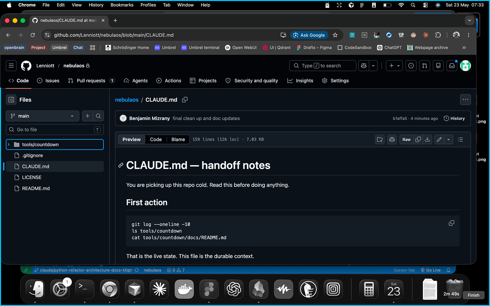
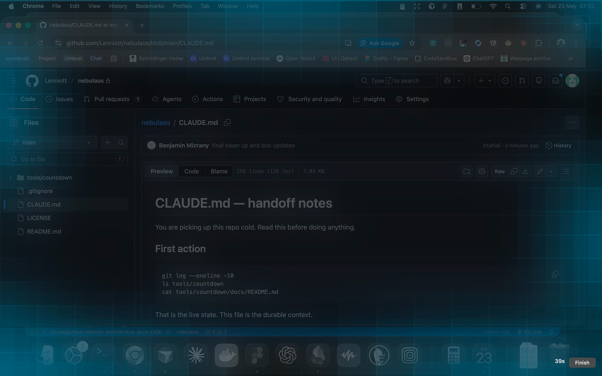

# CtimeLI

**CLI See Time** — macOS screen-edge countdown for time-blind work.

<p align="center">
  
  
  
</p>

For people who lose track of time mid-task: 10 minutes before a meeting becomes 5 minutes late, or you keep saying "just leave" and don't.

## Features

- Shrinking stroke around every display (click-through, all monitors)
- Edge glow + progressive blur in the final stretch (default: last 120s)
- HUD with remaining time + Finish button
- Block-on-end: full-screen stop overlay, then hide other apps + minimize focused window
- Watch mode: quick-add timers from stdin; calendar auto-start before events
- Calendar sessions: green stroke; manual: blue; retargets if a sooner event appears
- Remote meetings: parses Zoom/Meet/Teams URLs from calendar; opens link at zero when off work Wi-Fi (`WORK_WIFI_SSIDS`)
- In-person meetings: stop overlay shows room from event location

## Install

**Required**

- macOS
- Python 3.11+ (`python3` on PATH)

**Optional permissions** (countdown works without them)

- **Accessibility** — block-end window tidy (Hide Others + minimize)
- **Full Calendar Access** — watch mode calendar auto-start

```sh
./install.sh
```

Creates `.venv`, installs PyObjC + ctimeli, copies `.env`. Prompts to add `ctimeli` to `~/.zshrc` (runs watch mode). Non-interactive: `INSTALL_ZSHRC=1 ./install.sh`.

```sh
./uninstall.sh
```

Removes `.venv`, `.env`, `apps.manifest`, build caches, and the marked `ctimeli` block from `~/.zshrc` (`# >>> ctimeli >>>` … `# <<< ctimeli <<<`). Non-interactive: `UNINSTALL_YES=1 ./uninstall.sh`.

## Use

```sh
./run 15               # 15-minute timer
./run 6:00pm           # countdown to clock time
./run watch            # watch mode (quick-add + calendar)
```

After install, `ctimeli` in a new terminal runs watch (if you said yes to zshrc). Otherwise `./run watch`.

Watch stdin: `15` (minutes), `14:00` (clock time), `q` to quit.

## Development

```sh
./install.sh
.venv/bin/pip install -e ".[dev]"
.venv/bin/pytest
```

## Docs

[`docs/README.md`](docs/README.md) — architecture, features, domain formulas, ports, config.
