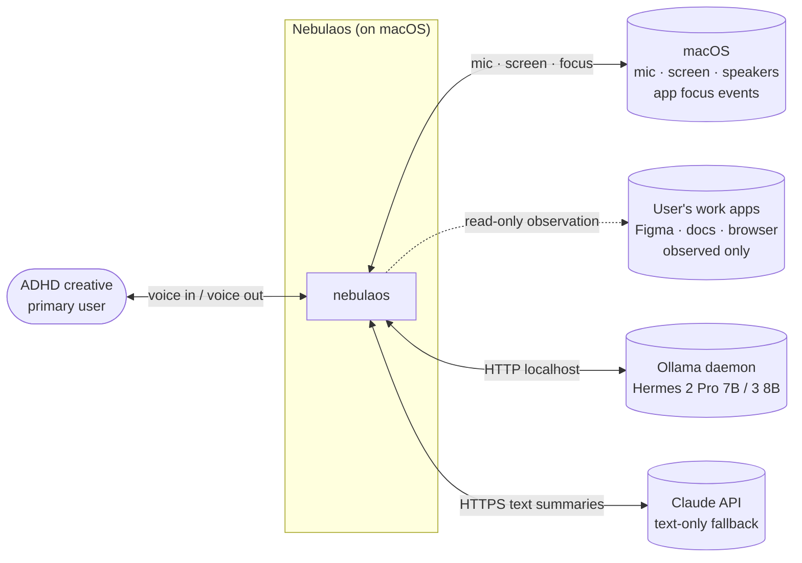
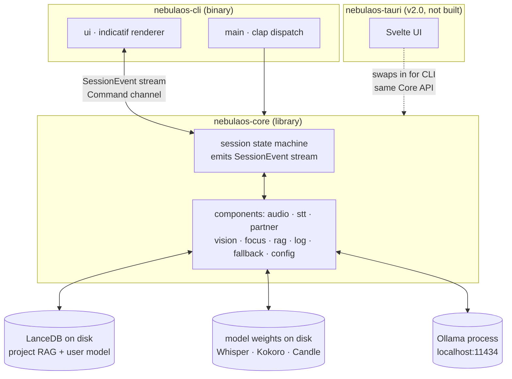
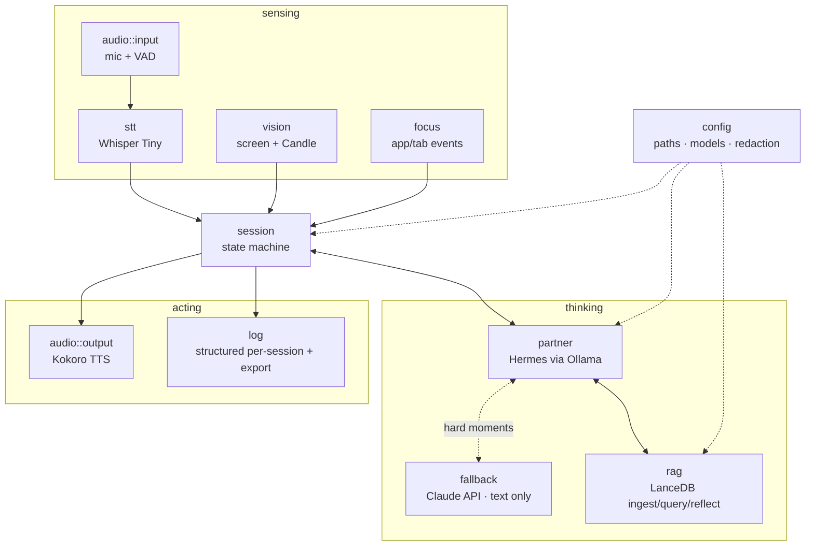

# Nebulaos — Architecture

C4 model. Levels 1–3. Level 4 (code) is skipped until something is worth diagramming.

The PRD (`./PRD`) is the source of truth for intent. This doc is the source of truth for shape.

## Level 1 — System Context

Nebulaos is a single on-device companion. One user, one machine. It reads from the world; it never writes to the user's work.

**Boundaries.** Audio cleared at session end. Screenshots processed on-device and discarded. Only text summaries reach the cloud LLM.

## Level 2 — Containers

**Frontend contract.** `nebulaos-core` exposes a `Stream<SessionEvent>` and an `mpsc::Sender<Command>`. The CLI subscribes and drives `indicatif`. A future Tauri app subscribes and drives Svelte. The core is forbidden from any `println!`, `indicatif`, or `clap` use — verified by grep in CI.

## Level 3 — Components (inside `nebulaos-core`)

**Module → file map (`crates/nebulaos-core/src/`).**

| Component | File | PRD anchor |
|-----------|------|------------|
| session state machine | `session/mod.rs` | §4 stories 1, 4, 7 |
| audio in / out | `audio/mod.rs` | §6 |
| speech-to-text | `stt/mod.rs` | §5 Whisper |
| vision classifier | `vision/mod.rs` | §4 story 3, §6 Candle |
| focus events | `focus/mod.rs` | §4 story 3 |
| thinking partner | `partner/mod.rs` | §5, §8 voice spec |
| cloud fallback | `fallback/mod.rs` | §5, §7 risks |
| rag store | `rag/mod.rs` | §5 memory |
| session log | `log/mod.rs` | §4 story 6 |
| config | `config/mod.rs` | §6 |

## Slice status

- Slice 1 — workspace, `Session`, `SessionEvent` stream, `Command` channel, CLI banner + progress bar, component modules stubbed with traits.
- Slice 2 — goal declaration plumbing. CLI prompts "what are we doing?", sends `Command::Declare`, session emits `GoalDeclared` + stub welcome.
- Slice 3 — `OllamaPartner` client + PRD §8 system prompt + `nebulaos chat`.
- Slice 3b — partner wired into the session loop. `run()` takes `Option<Arc<dyn Partner>>`; the live partner generates the welcome on `Declare` and a soft line on each `DriftSoftCheck`. Falls back to the stub welcome if Ollama is unreachable.
- Slice 4 — drift state machine. `Command::Focus { app, attention }` updates on-task/off-task counters. After 60s of accumulated off-task time the session emits `DriftSoftCheck` (5-min cooldown). Macros: when an `OnTask` focus arrives, the drift counter resets — drift cleared, no lecture.
- Slice 5 — file-backed RAG. `JsonlRag` appends one row per chunk to `chunks.jsonl`, substring-scores at query time, writes session reflections to `reflections.jsonl`. CLI: `nebulaos ingest <file>`, `nebulaos recall <query>`. Trait stays clean for the LanceDB swap.
- **Slice 6 (current).** `JsonlSessionLog` records every `SessionEvent` (ticks downsampled 1/60s) to `<data>/sessions/session-<ts>.jsonl`. `nebulaos export` finds the latest session and prints goal · on/off-task · ratio · drift count · partner lines · completion status. `ClaudeFallback` posts to Anthropic `/v1/messages` with the same voice-spec system prompt; `nebulaos fallback "
"` round-trips. `ANTHROPIC_API_KEY` from env.

### Deferred (need macOS for honest testing)

- Slice 2b — `cpal` mic + `whisper-rs` Whisper Tiny. Replaces `prompt::declare_goal()` with `mic.capture() → stt.transcribe()`. Trait contracts in `src/audio/mod.rs` and `src/stt/mod.rs` already match.
- Slice 3c — Kokoro TTS via `ort`. Replaces the bar's `bar.println("← {line}")` with an `AudioOutput::speak(line)` call.
- Slice 4-mac — `NSWorkspace` focus listener that drives `Command::Focus` for real. Trait in `src/focus/mod.rs` is ready.
- Slice 5b — swap `JsonlRag` for `lancedb` + an embedding model. Same `Rag` trait, no caller changes.
- Slice 4 — eyes (screen capture + Candle + focus).
- Slice 5 — memory (LanceDB).
- Slice 6 — log + export + Claude fallback.

Each slice keeps `cargo run -p nebulaos-cli -- start` runnable and updates this doc if a component's shape changes.
