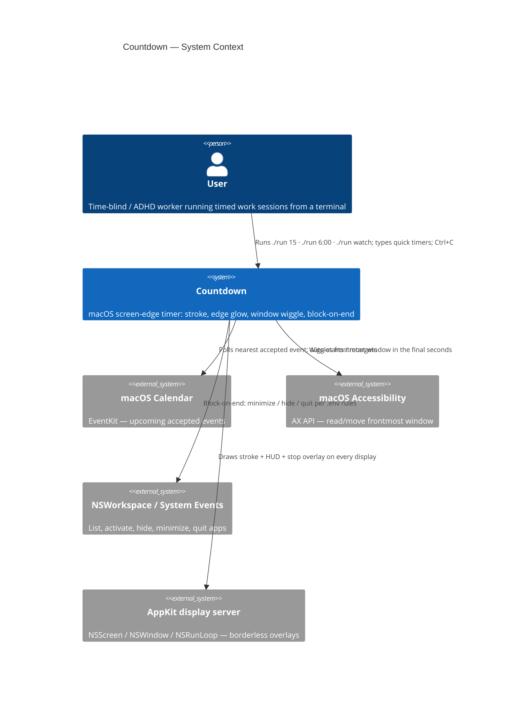
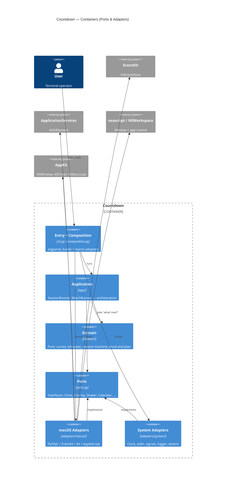
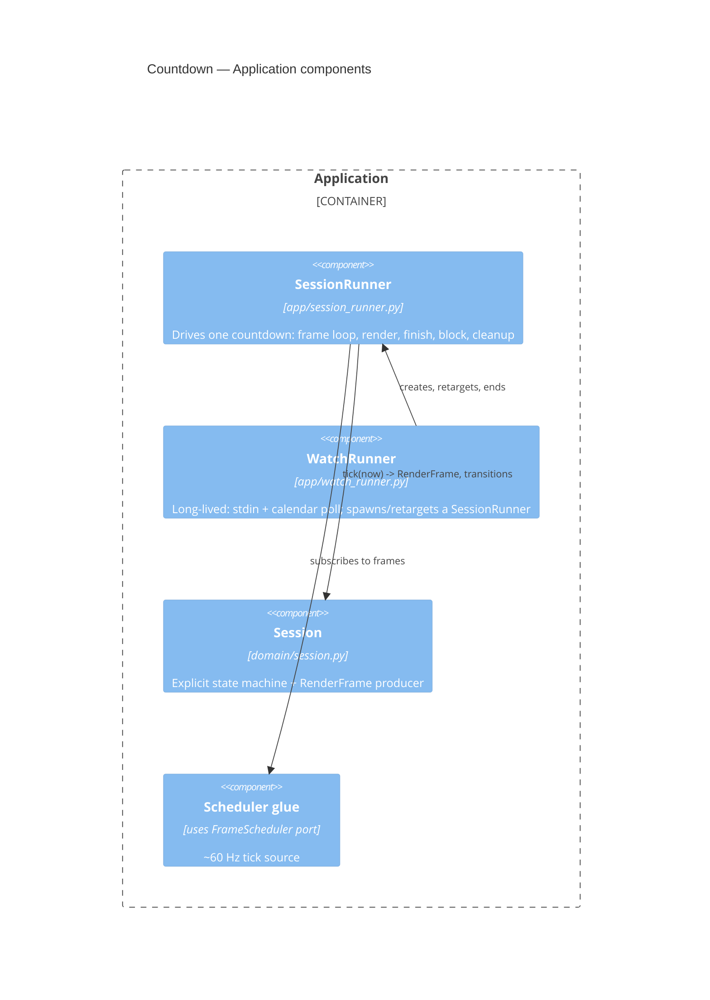
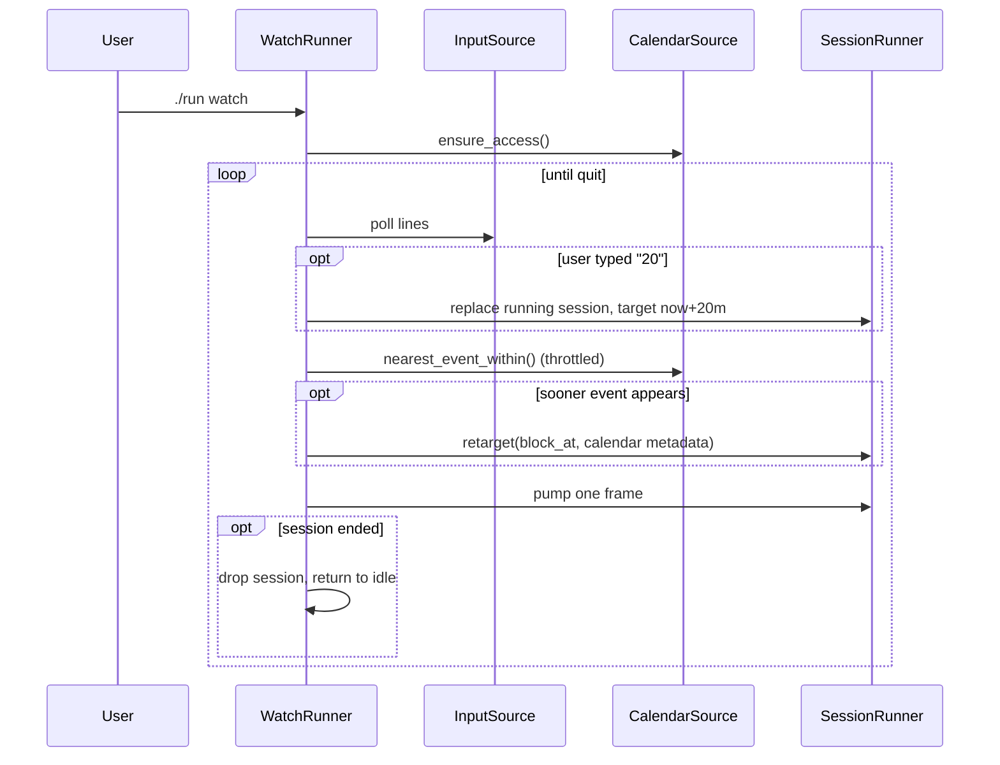

# Architecture

This document is the spine of the blueprint. It defines the layers, the
dependency rule, the C4 views, and the invariants that every change must
preserve. It is deliberately language-neutral — the same structure is intended
to survive a rewrite into Rust + Tauri (see [`porting.md`](porting.md)).

## 1. Why this shape

The original implementation was one 1864-line file (`countdown.py`) plus four
helpers. It mixed CLI parsing, Cocoa drawing, Accessibility FFI, AppleScript
subprocesses, timer math, a calendar poller, and an implicit state machine. It
could not be tested without a Mac in front of you, and it could not be ported
without re-reading every line.

The refactor applies **Ports & Adapters** (a.k.a. Hexagonal / Clean
Architecture). The goals, in priority order:

1. **Testability** — the logic that decides *when to glow, when to wiggle, when
   to block* must run on a Linux CI box with no display, no Mac, no clock.
2. **Portability** — the platform-specific 30% is quarantined behind interfaces
   so a Rust port replaces adapters, not logic.
3. **Single Responsibility** — one reason to change per module.
4. **Open/Closed** — a new session kind (calendar, hard-stop, …) is a new
   value, not a new `if` branch in a 300-line method.

## 2. The five layers

```
┌─────────────────────────────────────────────────────────────┐
│ COMPOSITION + ENTRY    cli.py · composition.py                │
│   parses argv, builds adapters, injects them, calls App       │
└───────────────┬───────────────────────────────┬──────────────┘
                │ depends on everything          │
┌───────────────▼──────────────┐  ┌──────────────▼──────────────┐
│ ADAPTERS                      │  │ APPLICATION    app/          │
│   adapters/macos/*  (PyObjC)  │  │   session_runner             │
│   adapters/system/* (stdlib)  │  │   watch_runner               │
│   implement Ports             │  │   orchestrates domain+ports  │
└───────────────┬───────────────┘  └──────────────┬──────────────┘
                │ implements                       │ depends on
                │                                  │
        ┌───────▼──────────────────────────────────▼───────┐
        │ PORTS    ports.py                                 │
        │   Clock, Logger, FrameScheduler, CountdownOverlay,│
        │   StopOverlay, WindowShaker, AppControl,          │
        │   BlockEndExecutor, CalendarSource, InputSource   │
        └───────────────────────┬───────────────────────────┘
                                │ uses only domain types
                ┌───────────────▼────────────────┐
                │ DOMAIN    domain/               │
                │   math · curves · colors        │
                │   timespec · session · calendar │
                │   blockend                      │
                │   PURE. No I/O. No platform.    │
                └─────────────────────────────────┘
```

### The dependency rule

> **Source-code dependencies point only inward. An inner layer must never name
> an outer layer.**

| Layer | May import | Must NOT import |
|-------|-----------|-----------------|
| `domain/` | stdlib only (`math`, `datetime`, `re`, `dataclasses`, `enum`) | ports, app, adapters, PyObjC |
| `ports.py` | `domain/`, `typing` | app, adapters |
| `app/` | `domain/`, `ports.py` | adapters, PyObjC, `argparse` |
| `adapters/` | `domain/`, `ports.py`, platform SDKs | app, `cli.py` |
| `composition.py`, `cli.py` | everything | — |

This is mechanically checkable. See [`development.md`](development.md) §"Guard
scripts" — a grep gate fails the build if `domain/` or `app/` imports `AppKit`,
`objc`, `EventKit`, or `adapters`.

### What lives where

| Layer | Responsibility | Examples |
|-------|----------------|----------|
| **Domain** | Decide *what should be true* given numbers. | `pulse_opacity(remaining, cfg)`, `parse_quick_input("6:00")`, `Session.tick()`, `plan_block_end(apps, cfg)` |
| **Ports** | Name *what the app needs from the world*. | `CountdownOverlay.set_pulse(...)`, `CalendarSource.nearest_event()`, `Clock.now()` |
| **Application** | Orchestrate: pull time from `Clock`, ask Domain what to render, push it to the `Overlay`, react to input. | `SessionRunner.run()`, `WatchRunner.run()` |
| **Adapters** | Make a Port real on this OS. | `MacOverlay` draws via `NSWindow`; `EventKitCalendar` queries `EKEventStore`; `SystemClock` calls `datetime.now()` |
| **Composition** | Wire concrete adapters into the app once, at startup. | `composition.build_session_runner(cfg)` |

## 3. C4 views

### Level 1 — System context



### Level 2 — Containers (refactored layout)



### Level 3 — Components inside Application



## 4. Runtime flows

### One-shot countdown (`./run 15`)

```mermaid
sequenceDiagram
  participant U as User
  participant CLI as cli.py
  participant C as composition.py
  participant S as SessionRunner
  participant D as Session (domain)
  participant O as CountdownOverlay
  participant W as WindowShaker

  U->>CLI: ./run 15
  CLI->>C: build_session_runner(cfg, target)
  C-->>CLI: SessionRunner (adapters injected)
  CLI->>S: run()
  S->>O: show()
  loop every frame (~60 Hz)
    S->>D: tick(clock.now())
    D-->>S: RenderFrame{fraction,label,color,pulse,shake}
    S->>O: render(frame)
    S->>W: apply(frame.shake) or restore()
  end
  alt block_on_end
    S->>D: state -> BLOCKING
    S->>O: hide(); show stop overlay
    U->>S: dismiss
    S->>S: execute block-end plan, then DONE
  else
    S->>S: state -> DONE
  end
  S->>O: teardown
```

### Watch mode (`./run watch`)



## 5. The session state machine

The original encoded session lifecycle in five loose booleans (`_done`,
`_interrupted`, `_blocked`, `_stop_modal_active`, `_setup_complete`). The
refactor makes it an explicit enum. Full transition table is in
[`domain.md`](domain.md) §"Session state machine"; the shape:

```mermaid
stateDiagram-v2
  [*] --> PENDING
  PENDING --> RUNNING: start()
  RUNNING --> RUNNING: tick / retarget
  RUNNING --> BLOCKING: (zero OR finish) AND block_on_end
  RUNNING --> DONE: (zero OR finish) AND NOT block_on_end
  RUNNING --> INTERRUPTED: Ctrl+C / stop()
  BLOCKING --> CLEANUP: overlay dismissed
  BLOCKING --> CLEANUP: Ctrl+C (counts as dismiss; interrupted flag set)
  CLEANUP --> DONE: block-end actions applied
  DONE --> [*]
  INTERRUPTED --> [*]
```



## 6. Invariants — do not break these

These are load-bearing. A change that violates one is a bug even if tests pass.

1. **The dependency rule** (§2). `domain/` and `app/` never import a platform
   SDK or an adapter. Enforced by a grep gate.
2. **Domain is pure.** No `print`, no `datetime.now()`, no file or network I/O,
   no randomness inside `domain/`. Time enters only as a parameter. This is what
   makes the domain deterministically testable.
3. **One Port per external concern**, and the Port is the *narrowest* surface
   the app needs — not a passthrough of the SDK. `WindowShaker` exposes
   `apply(offset)` / `restore()`, not `AXUIElementSetAttributeValue`.
4. **Adapters are dumb.** An adapter translates a Port call into SDK calls and
   back. It contains no timer math, no policy, no `if session_kind == …`. If an
   adapter starts making decisions, that logic belongs in the domain.
5. **The composition root is the only place `new`/constructors of adapters
   appear.** Everything else receives dependencies by injection.
6. **`RenderFrame` is the whole UI contract.** The overlay is told *what to
   draw* as plain data; it never asks the domain anything. Any new visual is a
   new field on `RenderFrame`, computed in the domain.
7. **Whisker of feedback latency**: the frame loop must stay ~60 Hz. Domain
   `tick()` is O(1) and allocation-light. Heavy work (calendar queries,
   AppleScript) is throttled and never on the per-frame path.
8. **Retarget never shrinks `total_seconds`.** The stroke fraction and pulse
   curves are computed against the original total; a calendar snap that pulls
   the target *in* must not make the ring jump backwards. See
   [`domain.md`](domain.md) §"Retarget".

## 7. Package layout

```
tools/countdown/
  run, shake                  # venv bootstrap scripts (unchanged UX)
  pyproject.toml              # package metadata + console entry points
  requirements.txt            # PyObjC frameworks (macOS only)
  .env.example                # documented config template
  countdown/
    cli.py                    # argparse; dispatches one-shot vs watch
    composition.py            # composition root — builds & injects adapters
    config.py                 # AppConfig dataclass + env/CLI merge
    ports.py                  # all Protocol interfaces
    domain/
      math.py                 # smoothstep, lerp, format_duration, clamp
      curves.py               # pulse_opacity, pulse_spread, shake_intensity
      colors.py               # RGB type, stroke_color_for_fraction
      timespec.py             # parse_target_time, parse_quick_input
      session.py              # SessionState, SessionKind, Session, RenderFrame
      calendar.py             # CalendarEvent, calendar_block_target
      blockend.py             # BlockAction, plan_block_end, name resolution
    app/
      session_runner.py       # orchestrates one session
      watch_runner.py         # watch-mode loop
    adapters/
      system/
        clock.py              # SystemClock
        logger.py             # StderrLogger
        dotenv.py             # dotenv parser (returns a mapping; no env mutation)
        stdin_source.py       # non-blocking line reader
        signals.py            # SIGINT handler
      macos/
        runloop.py            # NSRunLoop pump + NSTimer FrameScheduler
        overlay.py            # CountdownOverlay: stroke + edge glow windows
        hud.py                # timer label + Finish button
        stop_overlay.py       # full-screen block-on-end modal
        shaker.py             # AX frontmost-window shaker
        app_control.py        # NSWorkspace: frontmost, activate, list, policy
        block_executor.py     # BlockEndExecutor: AppleScript + native quit
        calendar.py           # EventKit CalendarSource
  tests/                      # pytest — domain exhaustive, app via fakes
  docs/                       # this folder
```

The migration map from the old symbols to these modules is in
[`development.md`](development.md) §"Symbol migration map".
